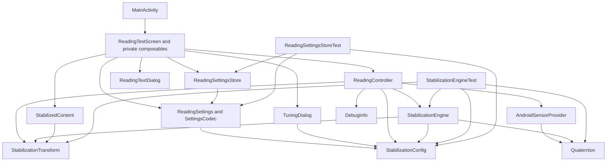
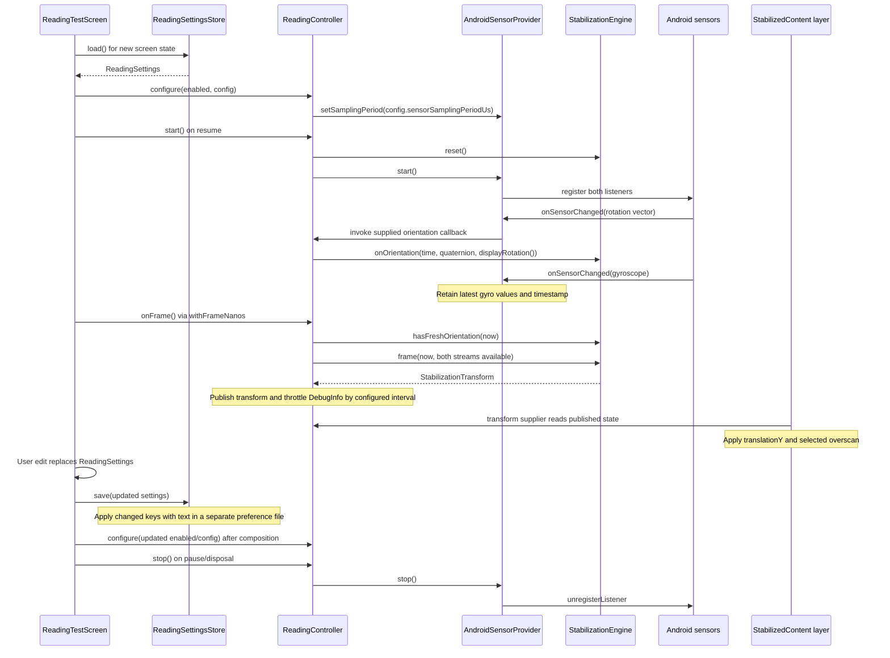

# SteadyScreen MVP 1 — implementation and dependency report

This report describes the source at commit `c6dcdacf06eab86964e04057cd09259d2f3c5084`
on `feat/persistent-settings`, inspected on 2026-09-07. It documents implemented
behavior, including its limits; it is not a claim of successful physical stabilization.
The application targets an experiment on the Pixel 8: whether counter-moving reading
content vertically makes text easier to read during short, unwanted phone rotations.

This file is a local report. It is intentionally untracked and uncommitted.

## 1. What was implemented, and where

The repository root is the Android project root. There is one application module,
`:app`, with package and namespace `com.steadyscreen`. Kotlin source happens to live
under the conventional `src/main/java` directory; the files themselves are Kotlin.

```text
SteadyScreen/
├── settings.gradle.kts                  Repository configuration and :app inclusion
├── build.gradle.kts                     Plugin versions
├── gradle.properties                    Gradle JVM and AndroidX configuration
├── gradlew / gradlew.bat                Gradle wrapper launchers
├── gradle/wrapper/                      Wrapper JAR, distribution and checksum
├── app/
│   ├── build.gradle.kts                 Android SDK levels and dependencies
│   └── src/
│       ├── main/
│       │   ├── AndroidManifest.xml      Launcher activity and application resources
│       │   ├── java/com/steadyscreen/
│       │   │   ├── MainActivity.kt
│       │   │   ├── sensor/AndroidSensorProvider.kt
│       │   │   ├── stabilization/
│       │   │   │   ├── Quaternion.kt
│       │   │   │   ├── StabilizationConfig.kt
│       │   │   │   ├── StabilizationEngine.kt
│       │   │   │   └── StabilizationTransform.kt
│       │   │   ├── settings/
│       │   │   │   ├── ReadingSettings.kt
│       │   │   │   └── ReadingSettingsStore.kt
│       │   │   ├── ui/
│       │   │   │   ├── ReadingController.kt
│       │   │   │   ├── ReadingTestScreen.kt
│       │   │   │   ├── ReadingTextDialog.kt
│       │   │   │   └── TuningDialog.kt
│       │   │   └── render/StabilizedContent.kt
│       │   └── res/                     Theme, label, launcher icon, backup rules
│       └── test/java/com/steadyscreen/
│           ├── stabilization/StabilizationEngineTest.kt
│           └── settings/ReadingSettingsStoreTest.kt
├── README.md                           Build, installation, tuning, physical trials
├── AGENTS.md                           Project requirements and workflow rules
└── .gitignore                          Generated and machine-local file exclusions
```

| Implemented capability | Primary location | Implementation boundary |
| --- | --- | --- |
| Android application startup | `MainActivity.kt` | Hosts a single Compose reading screen |
| Game rotation vector and gyro acquisition | `sensor/AndroidSensorProvider.kt` | Android APIs; no Compose state |
| Quaternion operations and display-axis mapping | `stabilization/Quaternion.kt` | Pure Kotlin math |
| Moving orientation reference and vertical filtering | `stabilization/StabilizationEngine.kt` | Pure Kotlin, deterministic timestamps |
| Experimental parameters and validation | `stabilization/StabilizationConfig.kt` | Immutable configuration values |
| Shared rendering output | `stabilization/StabilizationTransform.kt` | Value object; only Y is active |
| Sensor-to-UI coordination | `ui/ReadingController.kt` | Owns engine/provider and publishes Compose state |
| ON/OFF, gain, diagnostics, reading text | `ui/ReadingTestScreen.kt` | Compose controls, layout and lifecycle effects |
| All configuration values adjustable live | `ui/TuningDialog.kt` | Valid ranges/units, direction switch, reset defaults |
| Custom reading material | `ui/ReadingTextDialog.kt` | Local paste/edit/apply; original sample remains available |
| Saved user choices and encoding | `settings/ReadingSettings.kt` | Immutable settings and named-key codec; no Android or Compose |
| Permanent local settings/text storage | `settings/ReadingSettingsStore.kt` | App-private SharedPreferences; separate text storage |
| Moving and clipping the reading layer | `render/StabilizedContent.kt` | `graphicsLayer`, adjustable overscan shared by ON/OFF |
| Synthetic behavioral verification | `StabilizationEngineTest.kt` | 19 ordinary JUnit tests, no Android device |
| Settings restoration and saved resets | `ReadingSettingsStoreTest.kt` | 7 JVM tests using an in-memory preference double |

There is no separate `SensorProvider` interface, `SensorSample`, `MotionFilter`,
`MainScreen`, or `DebugScreen` class. The small implementation uses a callback for
orientation delivery, keeps the filter inside the engine, and implements diagnostics
as a private composable. The suggested architecture in `AGENTS.md` was a guide rather
than a requirement to create unused abstractions.

## 2. Class and file dependencies

### 2.1 Direct project-code dependencies

An arrow in the following diagram means “uses this project type/function.” It is a
source dependency, not necessarily the direction in which sensor data travels.



| Source file | Direct project dependencies | Why the dependency exists |
| --- | --- | --- |
| `MainActivity.kt` | `ReadingTestScreen()` | Calls the root composable from `setContent` |
| `ReadingTestScreen.kt` | `ReadingController`, `ReadingSettings`, `ReadingSettingsStore`, `TuningDialog()`, `ReadingTextDialog()`, `StabilizedContent()` | Restores settings, wires edits/save/lifecycle, renders original or custom content |
| `TuningDialog.kt` | `StabilizationConfig` | Copies config for live edits; creates defaults on reset |
| `ReadingTextDialog.kt` | None | Owns an unsaved draft and invokes apply/dismiss callbacks |
| `ReadingSettings.kt` | `StabilizationConfig` | Defines `ReadingSettings` and `SettingsCodec` |
| `ReadingSettingsStore.kt` | `ReadingSettings`, `SettingsCodec` | Reads/writes Android preferences through named string values |
| `ReadingController.kt` | `AndroidSensorProvider`, `StabilizationEngine`, `StabilizationConfig`, `StabilizationTransform`; local `DebugInfo` | Acquires samples, configures/runs the engine, creates published state |
| `AndroidSensorProvider.kt` | `Quaternion` | Converts Android's quaternion float buffer into the callback's value object |
| `StabilizationEngine.kt` | `Quaternion`, `StabilizationConfig`, `StabilizationTransform` | Computes orientation differences and output |
| `Quaternion.kt` | None | Uses Kotlin math and `Math.PI` only |
| `StabilizationConfig.kt` | None | Data and constructor validation only |
| `StabilizationTransform.kt` | None | Data only |
| `StabilizedContent.kt` | `StabilizationTransform` | Reads vertical translation through a supplied function |
| `StabilizationEngineTest.kt` | All four stabilization types | Exercises the engine and builds synthetic inputs |
| `ReadingSettingsStoreTest.kt` | `ReadingSettingsStore`, `ReadingSettings`, `SettingsCodec`, `StabilizationConfig` | Verifies the preference boundary, defaults, resets, text and write isolation |

The renderer does not know the engine or provider. The provider does not know the
controller class or the engine class: it invokes an injected function. The engine
does not import Android or Compose. The controller is the connection point between
platform acquisition, math, and observable UI state.

The provider nevertheless depends on the concrete `Quaternion` model in the
`stabilization` package. That is a shared math representation, not a dependency on
the engine's algorithm or lifecycle.

### 2.2 Object ownership and state

`ReadingTestScreen()` remembers one `ReadingController` for the current context/view
pair. The controller constructs one `StabilizationEngine` and one
`AndroidSensorProvider`. It passes the application context to the provider and a
callback that captures the engine and the injected display-rotation function.

| Owner | State | Readers/writers |
| --- | --- | --- |
| Reading screen | `settings` | `remember(settingsStore)`/`mutableStateOf`; initialized with `load()`, replaced and saved by `updateSettings` |
| Reading screen | `enabled`, `config`, `showDebug`, `customText` | Local values read from `settings` during composition; feed controls, renderer and configuration effect |
| Reading screen | `showTuning`, `showTextEditor` | `rememberSaveable` dialog visibility; not permanent preferences |
| Reading-text dialog | `draft` | `remember` only; persisted only after **Use text** |
| Settings store | `reading_settings`, `reading_text` preference handles | App-private files; loaded on new screen/store construction and updated by user callbacks |
| Provider | `running`, `status`, gyro XYZ, gyro timestamp | Public getters/private setters; provider writes, controller reads |
| Provider | Sensors, manager, main-thread handler, `FloatArray(4)`, mutable sampling period | Reuses the quaternion buffer; `setSamplingPeriod()` updates/re-registers acquisition |
| Engine | Reference, sample/frame times, display basis, smoothed pitch, output Y | Private, changed by `onOrientation()`, `frame()`, and `reset()` |
| Engine | `config`, `enabled` | Public mutable properties; controller configures them |
| Engine | `relativePitchRadians`, `orientationHz`, computed `rawTranslationY` | Exposed for controller diagnostics; pitch/rate setters are private |
| Controller | `transform`, `debug` | Compose `mutableStateOf`, public getters/private setters; updated by `onFrame()` |
| Controller | `lastDebugNanos` | Throttles diagnostics; reset by `start()` and changed enabled/config values |

`Qcurrent` is a local value named `current` in each `onOrientation()` call. It is not
stored as a separate long-lived property. `Qreference` is the long-lived, in-memory nullable
`reference` property. The latest accepted sample timestamp and smoothed pitch are
enough for later frame output.

Sensor/engine/UI access and settings callbacks are single-thread confined in the
current application. Android preferences schedule their own asynchronous disk writes.
There is no app-owned mutex, processing worker, event queue, Flow, or ViewModel.
Moving acquisition to a background thread would require an explicit synchronization
or message-passing design; the current classes are not advertised as thread-safe.

## 3. Functions and their exact responsibilities

### 3.1 Application and screen

Source: [MainActivity.kt](app/src/main/java/com/steadyscreen/MainActivity.kt).

`MainActivity` extends AndroidX `ComponentActivity`. Its `onCreate(Bundle?)` calls
the superclass, enables edge-to-edge content, and calls `setContent`. Inside that
composition it installs Material 3's light color scheme and invokes
`ReadingTestScreen()`. It does not register sensors or perform stabilization math.

Source: [ReadingTestScreen.kt](app/src/main/java/com/steadyscreen/ui/ReadingTestScreen.kt).

| Function/effect | Calls or reads | Concrete behavior |
| --- | --- | --- |
| `ReadingTestScreen()` | `LocalContext`, `LocalView`, `ReadingController(...)`, `ReadingSettingsStore.load()` | Remembers controller/store, restores user choices; rotation comes from `view.display?.rotation ?: 0` |
| `updateSettings` callback | New `ReadingSettings`, `settingsStore.save()` | Replaces observable settings, then immediately submits changed preferences for saving |
| `SideEffect` | `controller.configure(currentEnabled, currentConfig)` | Applies values already read during composition; updates engine and sensor period after successful composition |
| `LifecycleResumeEffect(controller)` | `controller.start()`; cleanup calls `controller.stop()` | Starts acquisition when resumed; stops on pause or effect disposal |
| `LaunchedEffect(controller)` | Repeats `withFrameNanos { controller.onFrame() }` while `isActive` | Requests one controller update per Compose frame; cancelled when the effect leaves composition |
| `Controls(...)` | Material 3 `Switch`/`Slider`/`TextButton`; callbacks `onEnabled`, `onGain`, `onTuning`, `onText` | ON/OFF, gain 0–2, **Tune settings** and **Reading text**; no direct sensor access |
| `DebugPanel(...)` | `controller.debug`, `enabled`, `expanded`, `onToggle` | Shows status and optionally formatted diagnostics; toggling persists visibility without stopping publication |
| `ReadingText(...)` | `customText`, `config.overscanScale`, transform supplier | Chooses original sample or lazy custom paragraphs; wraps either in the stabilized layer |
| `OriginalReadingSample()` | Scrolling `Column`, `ReadingParagraph()`, `ReadingHint()` | Bundled “A quieter journey” story: heading and six paragraphs |
| `ReadingHint()` | Compose `Text` | Reminder to compare ON/OFF and test only as a passenger |
| `ReadingParagraph(text)` | Compose `Text` | Uses a serif font, 19 sp size and 29 sp line height |

The UI selects a layout from available width/height, not from a hard-coded portrait
sensor axis. A wide layout uses a 300 dp scrolling controls/diagnostics column beside
the reading pane. A tall layout places controls above, diagnostics below, and gives
the reading pane the remaining height. Safe drawing padding protects content from
system bars. Paragraphs have 32 dp padding and 20 dp spacing.

`ReadingSettingsStore.load()` initializes screen state from local preferences. User
choices are not stored in the activity Bundle; a new screen loads them again. The
screen explicitly uses `rememberSaveable` only for the two dialog-visibility booleans.

The screen reads enabled/config values **during composition**, before creating its
`SideEffect`. This fixes the earlier update path where state read only inside the
effect could miss changes in `BoxWithConstraints`' nested control composition. Gain
and ON/OFF now update the engine through explicit composition inputs. Saving is done
by edit callbacks, not by the frame loop or diagnostic publication.

### 3.2 Sensor acquisition

Source: [AndroidSensorProvider.kt](app/src/main/java/com/steadyscreen/sensor/AndroidSensorProvider.kt).

`AndroidSensorProvider` implements `SensorEventListener`. Its constructor receives:

```kotlin
context: Context
samplingPeriodUs: Int
onOrientation: (Long, Quaternion) -> Unit
```

It obtains `SensorManager`, queries the default game rotation vector and gyroscope,
creates `Handler(Looper.getMainLooper())`, and allocates one reusable quaternion buffer.

| Method | Called by | Calls/dependencies and result |
| --- | --- | --- |
| `setSamplingPeriod(periodUs)` | `ReadingController.configure()` | Requires at least 5,000 µs; skips unchanged values; stores the period and stop/starts if running; otherwise uses it at the next start |
| `start()` | `ReadingController.start()` or sampling-period change | Returns if already running; requires manager and both sensors; calls `registerListener` twice with the requested period, zero batching latency, and main handler |
| `stop()` | `ReadingController.stop()` or sampling-period change | Clears running state; calls `unregisterListener(this)`; clears gyro values/timestamp; sets stopped status |
| `onSensorChanged(event)` | Android sensor framework | Ignores callbacks when stopped; dispatches by sensor type |
| Rotation-vector branch | Inside `onSensorChanged()` | Calls `SensorManager.getQuaternionFromVector`; creates `Quaternion(w,x,y,z)` from the four buffer elements; invokes `onOrientation(event.timestamp, q)` |
| Gyroscope branch | Inside `onSensorChanged()` | Rejects non-increasing timestamps and non-finite XYZ; replaces stored XYZ and timestamp; does not call the engine |
| `onAccuracyChanged(...)` | Android sensor framework | No-op; accuracy notifications do not affect compensation |

Both registrations must succeed. If either returns false, all listeners for this
provider are unregistered. `SecurityException` is caught, listeners are unregistered,
and an unavailable status is exposed. The code does not implement retries on a timer;
a later lifecycle start can attempt registration again.

The default requested 5,000 µs period corresponds to 200 Hz. The tuning UI offers
5–10 ms in 1 ms increments (requests of 200–100 Hz). This is a request, not a measured
or guaranteed rate. No sensor batching delay is requested. Android computes the fused
game rotation quaternion; this app neither integrates gyroscope velocity nor performs
its own fusion. The gyro supplies diagnostics and a freshness condition for enabling
output. Its displayed XYZ values remain in device axes, even in landscape.

The callback does not retain `SensorEvent` or its mutable values array. Rotation
callbacks do allocate small immutable quaternion objects, including intermediate
engine math objects. The implementation avoids allocating an event list/history and
does not publish Compose state from this callback; it is not allocation-free.

### 3.3 Controller and diagnostics

Source: [ReadingController.kt](app/src/main/java/com/steadyscreen/ui/ReadingController.kt).

`ReadingController(context, displayRotation)` builds the connection to the engine:

```kotlin
private val sensors = AndroidSensorProvider(
    context.applicationContext,
    engine.config.sensorSamplingPeriodUs
) { time, q ->
    engine.onOrientation(time, q, displayRotation())
}
```

The display-rotation function is evaluated for each orientation callback. Thus the
provider remains unaware of Compose views and display-axis mapping.

| Method | Called by | Effects |
| --- | --- | --- |
| `configure(enabled, config)` | Screen `SideEffect` | Resets debug timing when values change, assigns enabled/config, calls `sensors.setSamplingPeriod()`; preserves filter state and provider object |
| `start()` | Screen resume effect | Calls `engine.reset()`, resets diagnostic timing, calls `sensors.start()` |
| `stop()` | Screen pause/disposal cleanup | Calls only `sensors.stop()`; does not synchronously reset the engine or published transform |
| `onFrame()` | Screen frame coroutine | Reads elapsed realtime, calculates freshness, calls `engine.frame()`, publishes transform; periodically constructs `DebugInfo` |

The availability calculation is:

```text
gyroFresh = gyroTimestamp > 0
            AND now >= gyroTimestamp
            AND (now - gyroTimestamp) * 1e-9 <= sensorTimeoutSeconds

orientationFresh = engine.hasFreshOrientation(now)
available = sensors.running AND gyroFresh AND orientationFresh
```

`onFrame()` calls `engine.frame(now, available)`. The engine checks its own orientation
freshness again; it has no access to the gyro or provider. The controller supplies
those extra constraints through the boolean argument.

The controller takes `now` from `SystemClock.elapsedRealtimeNanos()`. It uses the
Compose frame callback to schedule work but deliberately does not pass that callback's
frame timestamp into the engine. Sensor age comparisons need the sensor timebase.

`DebugInfo` is a data class defined in the same file. Its field dependencies are:

| Debug field | Source and units |
| --- | --- |
| `pitchDegrees` | `Math.toDegrees(engine.relativePitchRadians)` |
| `gyroX`, `gyroY`, `gyroZ` | Provider values, rad/s |
| `rawY` | `engine.rawTranslationY`, pixels before smoothing/dead-zone/clamp |
| `finalY` | The just-published `transform.translationY`, pixels |
| `orientationHz` | Engine estimate when orientation is fresh; otherwise 0 |
| `status` | Provider failure/stopped status, stale orientation, stale gyro, or “Both sensors active,” in that priority order |

There is no `enabled` field in `DebugInfo`. `DebugPanel()` receives the screen's
`enabled` state separately, so the ON/OFF label does not wait for a diagnostic tick.
Stale pitch/raw/gyro values can remain displayed; the status and zeroed stale rate
identify invalid stream freshness. “Both sensors active” is a freshness/registration
check, not a claim of successful physical compensation.

The default diagnostic interval is 200,000,000 ns (5 Hz); tuning offers 100–1,000 ms
(10–1 Hz). Publication is checked on frames and may be slower if frame delivery slows.
A changed config or enabled flag resets the throttle for a prompt diagnostic refresh. Hiding the
panel's detailed values does not stop sensors or diagnostic publication; its status
line remains visible.

### 3.4 Engine public API and reset semantics

Source: [StabilizationEngine.kt](app/src/main/java/com/steadyscreen/stabilization/StabilizationEngine.kt).

| Member | Direct dependencies | Result or responsibility |
| --- | --- | --- |
| `onOrientation(timestampNanos, orientation, displayQuarterTurns)` | Quaternion normalization, basis, multiplication, `follow`, unit inverse, pitch extraction; private `alpha()`; config | Updates reference, filtered pitch, sample timestamp and rate; returns `Unit` |
| `hasFreshOrientation(nowNanos)` | Last accepted timestamp and config timeout | Returns whether orientation age is nonnegative and within timeout |
| `frame(nowNanos, sensorsAvailable = true)` | Freshness method, filter state, config, `exp`, `sign`, `abs`, `coerceIn`, transform constructor | Calculates active output or neutral decay, returns `StabilizationTransform` |
| `rawTranslationY` getter | Relative pitch, pixels/radian, gain, direction | Calculates unsmoothed/unclamped diagnostic compensation on access |
| `reset()` | Private engine state | Clears baseline/timestamps/pitch/output/rate |
| `alpha(dt, tau)` | `exp()` | Time-based filter coefficient; returns 1 when `tau == 0` |

`reset()` does not change `enabled`, `config`, `screenRotation`, or `screenBasis`.
Clearing the reference ensures the next valid sample becomes a neutral baseline even
when the cached display basis remains unchanged. It also does not directly update
the controller's already-published Compose state; the next frame does that.

### 3.5 Renderer and transform model

Sources: [StabilizedContent.kt](app/src/main/java/com/steadyscreen/render/StabilizedContent.kt)
and [StabilizationTransform.kt](app/src/main/java/com/steadyscreen/stabilization/StabilizationTransform.kt).

The transform is a data class containing `translationX`, `translationY`, and
`rotationZ`, all initially zero. Engine outputs set only `translationY`. There is no
confidence property in the actual implementation.

`StabilizedContent()` receives a transform supplier rather than an already-read
transform value. Its outer `Box` clips to the reading viewport and paints the surface
background. Its inner full-size `Box` contains:

```kotlin
Modifier.fillMaxSize().graphicsLayer {
    translationY = transform().translationY
    scaleX = overscanScale
    scaleY = overscanScale
}
```

The supplier invokes the closure from `ReadingText()`, which reads
`controller.transform`. Reading observable state inside this layer block lets a
transform change invalidate the graphics layer without requiring paragraph composition
or layout for that change. Other changes, such as UI state or constraints, can still
cause ordinary recomposition/layout. The render function never calls `engine.frame()`.

X translation and Z rotation are not applied by this renderer, even though fields
exist in the shared model. Supporting those dimensions would require renderer changes
as well as engine changes. The selected scale applies equally in ON and OFF modes;
switching ON/OFF does not change text size. Editing overscan changes scale live.
Controls and diagnostics sit outside the transformed layer.

### 3.6 Tuning and reading-text dialogs

Sources: [TuningDialog.kt](app/src/main/java/com/steadyscreen/ui/TuningDialog.kt) and
[ReadingTextDialog.kt](app/src/main/java/com/steadyscreen/ui/ReadingTextDialog.kt).

`TuningDialog(config, onConfig, onDismiss)` is a scrollable Material 3 `AlertDialog`.
Each slider copies one config field and invokes `onConfig` immediately. The screen
merges it into `ReadingSettings`, saves the change and supplies it to the controller.
There is no pending tuning draft: **Done**, Back, and outside dismissal simply close
the dialog and do not undo edits. Gain appears here and on the main screen; both
controls use the same config. The direction switch chooses exactly −1 or +1.
`TuningSlider()` displays the current value with a supplied unit/format and adds a
semantic description. Section 6 lists all ranges and conversions.

**Reset defaults** calls `onConfig(StabilizationConfig())`. It resets and saves all
twelve tuning values while preserving stabilization ON/OFF, diagnostic visibility
and reading text. This is a settings reset, not `StabilizationEngine.reset()`; the
reference is not explicitly cleared. Resetting sampling may re-register listeners.

`ReadingTextDialog(text, onApply, onDismiss)` starts a `remember` draft from the saved
text. Its multiline field shows 4–8 lines and a character count. **Use text** is
enabled for nonblank drafts whose Kotlin `String.length` is at most 100,000 (UTF-16
code units); applying trims leading/trailing whitespace, saves the result and closes
the dialog. An oversized draft is retained for editing but cannot be applied. **Use
original sample** applies an empty string immediately, saves that selection and
closes. **Cancel**, Back, or outside dismissal discards the draft; rotation/activity
recreation also loses unapplied edits because the draft is not saveable.

For nonempty saved text, `ReadingText()` remembers paragraph splitting on blank lines
(including CRLF separators), then uses a `LazyColumn` with a “Your reading text”
heading, paragraph items, and `ReadingHint()`. The list is keyed by the document so
replacing it starts at the beginning. The original story uses a scrolling `Column`.
Neither path adds a separately persisted reading position. No movie script is bundled.

### 3.7 Persistent settings and default recovery

Sources: [ReadingSettings.kt](app/src/main/java/com/steadyscreen/settings/ReadingSettings.kt)
and [ReadingSettingsStore.kt](app/src/main/java/com/steadyscreen/settings/ReadingSettingsStore.kt).

`ReadingSettings` is an immutable snapshot containing `enabled = true`, a default
`StabilizationConfig`, `showDebug = true`, and `readingText = ""`. It contains user
choices only, with no sensor timestamps, quaternions, transforms, or history.

`ReadingSettingsStore` accepts two `SharedPreferences` handles for testing or opens
them using the application context and `Context.MODE_PRIVATE`:

| Preference file | Keys and representation | When it changes |
| --- | --- | --- |
| `reading_settings` | `enabled`, `showDebug`, and all twelve config property names; all values encoded as strings | Control/config edits; tuning reset |
| `reading_text` | `text`, a string; empty means original sample | Initialized on first save; subsequently changed by applying text or choosing the original sample |

`SettingsCodec.encode()` maps the booleans and numeric fields to named strings.
Using string conversion preserves the configured Double precision and avoids
ordinal/index-based storage. Text is kept outside this map and in its own preference
file, so gain/config edits do not rewrite a potentially long document.

`load()` reads the two maps and passes them to `SettingsCodec.decode()`:

- Missing, wrong-type, or unparsable numeric entries use the corresponding defaults.
- A numeric value that parses but violates a `StabilizationConfig` invariant (for
  example NaN gain or a zero return time) causes the entire config to fall back to
  defaults. Text and ON/OFF/visibility choices are decoded independently.
- Booleans use strict string parsing and fall back to `true` if invalid or missing.
- Missing or wrong-type text selects the original sample. Unknown keys are ignored.

`save()` encodes the snapshot and calls `writeChanges()` on each preference file.
This helper compares existing values, skips an unchanged file, and writes only
changed keys using `androidx.core.content.edit` with its asynchronous `apply()` path.
There is no explicit Save button or app-owned debounce. The preference memory map
updates immediately; Android schedules disk writes. The two files are separate
writes, not one cross-file transaction. No disk-write acknowledgement or failure
indicator is exposed in the UI.

New screen/store instances restore persisted choices after app restarts. Dialog
visibility remains temporary Compose state, and the old `StabilizationConfigSaver`
and its activity-state test have been removed. Backup and device-transfer rules
exclude preferences. Clearing app data or uninstalling removes these local settings
and reading material. Actual Android disk/lifecycle restoration still requires device
verification; the JVM tests exercise the store with a preference test double.

## 4. Runtime call sequences and lifecycle

The controller owns acquisition and calculation, but it is called on two different
schedules. Sensor events update ordinary math state. Frame events publish UI state.



The diagram separates conceptual events; rotation and gyro delivery can interleave,
and composition effects/frame callbacks have their own scheduling. No code relies on
a particular order between the two sensor streams. Compensation waits for both.

| Event | Acquisition | Engine and visible-state behavior |
| --- | --- | --- |
| First resume | Attempts both registrations | Screen restores saved choices; engine resets; first orientation establishes baseline; saved OFF state prevents active output |
| Normal resumed operation | Both sensors requested continuously | Orientation samples update filter; frames apply latest available output |
| Switch OFF | Sensors continue | Frames decay displayed Y; subsequent orientation samples set reference to current and clear smoothed pitch |
| Switch ON | Already registered | Next valid processing/frame uses the baseline maintained during OFF |
| Gain change | Unchanged | Saved config is replaced; next advancing frame uses gain without another orientation sample; clamp still limits amplitude |
| Sampling period change | Stop/start if already running; otherwise next start uses it | Clears gyro freshness; availability can temporarily drop; no explicit engine reset |
| Overscan change | Unchanged | Saves config and updates renderer scale for both ON/OFF |
| Other tuning change | Unchanged | Saved config feeds the relevant engine/frame/diagnostic consumer |
| Tuning reset | Re-registers only if sampling period changes | Saves default config; preserves ON/OFF, debug visibility, text, and current filter state |
| Apply text / original sample | Unchanged | Saves the document/empty selection; reader switches content |
| Toggle diagnostics | Unchanged | Saves expansion state; acquisition and diagnostic publication continue |
| New launch after settings edits | Registers on resume | Restores saved settings/text; never restores sensor/filter history |
| Pause/background | Both listeners unregistered | `stop()` retains engine output; any ensuing frames can decay it because availability is false |
| Resume after pause | Registers again | `start()` explicitly resets the engine; next valid sample becomes a new baseline |
| Screen leaves composition | Listeners unregistered, frame coroutine cancelled | No remaining reading layer to animate |
| Display rotation change | Provider callback reads new rotation | Next accepted orientation rebuilds basis, rebases, clears filtered pitch/rate |
| Orientation gap over timeout | Registration may still exist | Frames fall back when stale; the returning sample rebases |
| Only gyro becomes stale | Orientation may continue processing | Controller disables active frame output; gyro recovery alone does not reset the orientation reference |

The frame coroutine is composition-scoped, not explicitly paused by the resume effect.
Actual frame delivery may stop while backgrounded. The code guarantees listener cleanup;
it does not guarantee that an offscreen return-to-zero animation is rendered. A lifecycle
restart, display rebase, or first sample after a long gap can establish zero directly;
the special exponential return applies to the inactive branch of `frame()`.

## 5. Mathematical implementation

The following equations describe the source order, rather than an alternative filter.
Angles are radians internally; timestamps are nanoseconds converted to seconds;
translation is physical screen pixels. Quaternion components and pitch/filter state
use `Double`; output, gain, scale and gyro display values use `Float`.

### 5.1 Quaternion representation and primitives

Source: [Quaternion.kt](app/src/main/java/com/steadyscreen/stabilization/Quaternion.kt).

The data class stores a Hamilton quaternion in scalar-first order:

```text
q = (w, x, y, z)
identity = (1, 0, 0, 0)
```

| Function | Mathematical operation | Used by |
| --- | --- | --- |
| `normalizedOrNull()` | Divide all components by their Euclidean norm; reject invalid norm | Engine input validation; `follow()` result normalization |
| `inverseUnit()` | Return the conjugate `(w, -x, -y, -z)` | Engine relative orientation; rotation tests |
| `operator times(other)` | Hamilton product | Engine display mapping and relative orientation; tests |
| `follow(other, fraction)` | Shortest-arc normalized linear interpolation | Engine moving reference |
| `pitchRadians()` | Extract relative X-axis Euler angle with `atan2` | Engine relative pitch |
| `Identity` | Unit quaternion constant | Engine initial display basis; tests |
| `screenBasis(quarterTurns)` | Z-axis basis quaternion for display rotation | Engine basis changes; display-axis tests |

Normalization computes:

```text
norm(q) = sqrt(w² + x² + y² + z²)
normalize(q) = q / norm(q)
```

Non-finite norms or norms below `1e-12` return `null`. This prevents zero/NaN/infinite
inputs from becoming engine state. `inverseUnit()` assumes normalization already
occurred; it does not divide by the squared norm itself.

For two quaternions `a` and `b`, `times()` computes:

```text
(a*b).w = aw*bw - ax*bx - ay*by - az*bz
(a*b).x = aw*bx + ax*bw + ay*bz - az*by
(a*b).y = aw*by - ax*bz + ay*bw + az*bx
(a*b).z = aw*bz + ax*by - ay*bx + az*bw
```

Order matters. The engine uses `inverse(reference) * current`, not the reverse
product. This expresses the relative orientation in the reference frame.

### 5.2 Validation, time step and display basis

`onOrientation()` first rejects negative timestamps, display rotations outside 0–3,
duplicate/out-of-order timestamps, and quaternions that fail normalization. Rejected
samples do not replace the last accepted sample timestamp.

For display rotation `k` in quarter turns, the implementation defines:

```text
halfAngle = k * π / 4
B(k) = (cos(halfAngle), 0, 0, sin(halfAngle))
Qcurrent = normalize(Qdevice) * B(k)
```

| `k` | Display turn | `B(k)` approximately |
| --- | --- | --- |
| 0 | 0° | `(1, 0, 0, 0)` |
| 1 | 90° | `(0.707107, 0, 0, 0.707107)` |
| 2 | 180° | `(0, 0, 0, 1)` |
| 3 | 270° | `(-0.707107, 0, 0, 0.707107)` |

This rotates the local basis so pitch is tied to the display's horizontal direction.
It does not activate horizontal content translation or screen-rotation compensation.

The sensor interval is measured between accepted samples:

```text
dt = (timestampNanos - previousTimestampNanos) * 1e-9
```

If there is no reference yet, the display rotation changed, or `dt > sensorTimeoutSeconds` (default 0.25 s), the
engine sets `reference = current`, clears relative/smoothed pitch and rate, and returns.
That sample establishes the baseline and does not generate a pitch response. A gap
exactly equal to the timeout is still accepted for normal processing.

### 5.3 Slowly following reference

For each normal sample, the engine computes:

```text
alphaRef = 1 - exp(-dt / referenceTimeConstantSeconds)
Qreference = follow(Qreference, Qcurrent, alphaRef)
```

`follow()` is normalized linear interpolation (NLERP), not spherical interpolation
(SLERP). Because `q` and `-q` describe the same orientation, it first selects the sign
that keeps the interpolation on the shorter quaternion arc:

```text
dot = reference.w*current.w + reference.x*current.x
    + reference.y*current.y + reference.z*current.z

direction = -1 if dot < 0, otherwise +1
QreferenceNew = normalize(
    (1 - alphaRef)*QreferenceOld + alphaRef*direction*Qcurrent
)
```

For small relative angles, this behaves approximately like an exponential low-pass
filter on the baseline angle. Large-angle interpolation is not exactly exponential
in angle, because NLERP is normalized component interpolation.

The reference is updated **before** relative pitch is extracted. A small portion of
each current disturbance is therefore absorbed into the baseline immediately.

### 5.4 Relative pitch and smoothing

The relative quaternion and scalar angle are:

```text
Qdelta = inverseUnit(QreferenceNew) * Qcurrent

pitch = atan2(
    2*(Qdelta.w*Qdelta.x + Qdelta.y*Qdelta.z),
    1 - 2*(Qdelta.x² + Qdelta.y²)
)
```

The project calls this angle pitch because it represents rotation about the display's
horizontal X axis. Euler-angle labels differ between coordinate conventions; the
formula, rather than the name alone, specifies the implementation. It is suitable for
the intended small deviations around a moving baseline. Large combined rotations can
couple other components into it or encounter Euler-angle ambiguities.

When enabled, a second exponential filter smooths the relative angle:

```text
alphaSmooth = 1 - exp(-dt / smoothingTimeConstantSeconds)
smoothedPitchNew = smoothedPitchOld
                 + alphaSmooth*(pitch - smoothedPitchOld)
```

For a zero smoothing time constant, the helper returns coefficient 1, so the smoothed
value becomes the current pitch immediately. Reference and return time constants must
be positive; smoothing is the one filter time constant allowed to be zero.

When disabled, this normal sample path instead sets `reference = current` and
`smoothedPitch = 0`. `relativePitchRadians` was already calculated before this
replacement, so diagnostic raw motion may remain nonzero while OFF. Re-enabling
after OFF samples uses the newly maintained reference. Merely assigning
`enabled = false` does not synchronously clear the pitch state; that occurs on the
next accepted normal orientation sample.

### 5.5 Why this has a high-pass/band-pass response

The following is a small-angle derivation from the implemented update equations,
not a separately implemented frequency-domain filter.

Approximate device pitch by scalar `theta[n]`, reference angle by `r[n]`, and hold
the sample interval constant. With `a = exp(-dt/tauRef)`:

```text
r[n] ≈ a*r[n-1] + (1-a)*theta[n]
p[n] = theta[n] - r[n]
     ≈ a*(p[n-1] + theta[n] - theta[n-1])
```

Therefore the approximate discrete relative-pitch transfer function is:

```text
Hrelative(z) ≈ a*(1 - z^-1) / (1 - a*z^-1)
```

A constant angle is eventually absorbed into the reference. A sudden change appears
as an initial deviation that decays as the reference follows. A continuously changing
slow angle can maintain a small lag-dependent offset while the movement continues;
it does not have to be exactly zero until the movement settles.

With `b = exp(-dt/tauSmooth)`, the additional smoothing has transfer function:

```text
Hsmooth(z) = (1-b) / (1 - b*z^-1)
```

The first stage attenuates very slow motion; the second attenuates very fast changes.
In the continuous small-angle approximation, they resemble a high-pass stage
`s*tauRef/(1+s*tauRef)` followed by a low-pass stage `1/(1+s*tauSmooth)`.
The nominal corner frequencies `1/(2*pi*tau)` are approximately 0.35 Hz and 8.84 Hz
with the defaults. They describe a broad approximate response, not strict rejection
boundaries or measured device bandwidth. Dead zone, clamping, variable sampling,
quaternion interpolation and frame timing prevent treating the complete app as a
single exact linear filter.

### 5.6 Dead zone, angular-to-pixel mapping and clamp

On each advancing active frame, the engine applies a continuous dead zone:

```text
effectivePitch = sign(smoothedPitch)
               * max(abs(smoothedPitch) - deadZoneRadians, 0)

candidateY = effectivePitch * pixelsPerRadian * gain * compensationDirection
outputY = clamp(candidateY, -maxVerticalTranslationPx, +maxVerticalTranslationPx)
```

Subtracting the threshold outside the dead zone makes the output continuous at the
threshold. Simply passing the original angle once it crosses the threshold would
introduce a jump, which this implementation avoids.

The default factor is `1000 * 0.6 * -1 = -600 px/rad` after dead-zone subtraction.
This is an experimental linear mapping; the app does not measure viewing distance,
eye position, visual angle, or physical displacement. It does not use `tan(pitch)` or
derive pixel gain from optics. Positive relative pitch gives negative screen Y by
default. Whether that sign helps a reader must be checked on the Pixel 8.

`rawTranslationY` is separately computed as:

```text
rawY = relativePitchRadians * pixelsPerRadian * gain * compensationDirection
```

This raw diagnostic is downstream of the moving reference, but upstream of smoothing,
dead zone and clamp. It is not an unprocessed sensor value. It is not bounded by the configured clamp (default ±80 px).
The final diagnostic is the actual displayed frame output, including inactive decay.

There is no extra active-output interpolation or prediction between sensor samples.
Active frames evaluate the latest smoothed pitch; successive frames can reuse the
same pitch. Gain is applied at frame time, which allows a gain change to take effect
without waiting for another sensor sample.

### 5.7 Inactive output and reset behavior

Active compensation requires all three conditions:

```text
enabled AND sensorsAvailable AND hasFreshOrientation(nowNanos)
```

Otherwise `frame()` decays its previous output, using the interval between advancing
frame calls:

```text
dtFrame = (nowNanos - previousFrameNanos) * 1e-9
outputY = outputY * exp(-dtFrame / returnTimeConstantSeconds)
if abs(outputY) < 0.01 px: outputY = 0
outputY = clamp(outputY, -maximum, +maximum)
```

With the default 0.08 s return time constant, the remaining displacement is about
36.8% after 80 ms and 5.0% after 240 ms of accumulated inactive frame time. The 0.01 px
snap avoids retaining an indefinitely shrinking nonzero value.

On the first frame after construction/reset, no previous frame time exists, so the
inactive decay interval is zero; reset output is already zero. For duplicate or
backward frame timestamps, `frame()` returns the existing transform immediately,
without advancing state or reapplying changed configuration. The app supplies
advancing elapsed-realtime values; deterministic tests can exercise other values.

Explicit `reset()` sets internal output to zero immediately. Rebasing orientation
clears filtered pitch, so a subsequent active frame can also output zero immediately.
These are distinct from the exponential OFF/unavailable path.

### 5.8 Approximate orientation sample frequency

For normal accepted samples:

```text
instantHz = 1 / dt
if orientationHz == 0:
    orientationHz = instantHz
else:
    orientationHz += (1 - exp(-dt/0.5)) * (instantHz - orientationHz)
```

This is an exponentially smoothed reciprocal interval. It is not an event count over
a fixed window, a gyro rate, or a display-frame rate. Sampling irregularity can affect
the estimate. Rebasing/reset clears it; the controller shows zero when orientation is
stale. The first baseline-only sample does not establish a nonzero rate.

### 5.9 Worked first-response example

Assume a neutral identity baseline, default configuration, enabled stabilization,
fresh gyro data, and a +0.06 rad pure display-X rotation arriving 5 ms later. The first
frame using that sample approximately produces:

| Stage | Value |
| --- | --- |
| Reference coefficient `1-exp(-0.005/0.45)` | 0.01104961 |
| New reference angle from quaternion NLERP | 0.00066288 rad |
| Relative pitch | 0.05933712 rad |
| Smoothing coefficient `1-exp(-0.005/0.018)` | 0.24253487 |
| Smoothed pitch from initial zero | 0.01439132 rad |
| After subtracting the 0.0015 rad dead zone | 0.01289132 rad |
| After multiplying by −600 px/rad | −7.73479 px |
| Final clamp | Still −7.73479 px |
| Raw diagnostic before smoothing/dead zone | −35.60227 px |

Continued samples at the same angle initially let smoothing catch up while the
reference follows, then the deviation decays toward the dead zone. This calculation
explains the software's initial response; it does not establish perceived direction
or reading benefit on a physical screen.

## 6. Configuration and where each value is consumed

Sources: [StabilizationConfig.kt](app/src/main/java/com/steadyscreen/stabilization/StabilizationConfig.kt)
and [TuningDialog.kt](app/src/main/java/com/steadyscreen/ui/TuningDialog.kt).

`StabilizationConfig` is immutable; `copy()` creates a validated instance for each edit.
The screen stores it in `ReadingSettings.config`, persists it, and passes it to the
controller. The engine's config reference is mutable. Defaults seed a new installation,
missing preferences, and **Reset defaults**; saved values take precedence on launch.

| Property | Default | Tuning UI range / representation | Actual consumer |
| --- | --- | --- | --- |
| `gain` | `0.6f` | 0–2, also available on main screen | Engine frame mapping and raw getter |
| `maxVerticalTranslationPx` | `80f` | 1–200 px; displays ±clamp | Engine final clamp |
| `deadZoneRadians` | `0.0015` | 0–0.02 rad | Engine active frame dead zone |
| `referenceTimeConstantSeconds` | `0.45` | 0.05–2 s | Reference update in `onOrientation()` |
| `smoothingTimeConstantSeconds` | `0.018` | 0–0.2 s; 0 bypasses smoothing | Pitch smoothing in `onOrientation()` |
| `returnTimeConstantSeconds` | `0.08` | 0.01–0.5 s | Engine inactive frame decay |
| `pixelsPerRadian` | `1000f` | 100–5,000 px/rad | Engine frame mapping and raw getter |
| `compensationDirection` | `-1f` | **Reverse direction (+1)** switch: −1 or +1 | Engine frame mapping and raw getter |
| `overscanScale` | `1.08f` | 1–1.3× | Screen passes current config scale to reading renderer |
| `sensorTimeoutSeconds` | `0.25` | 0.05–1 s | Engine sample-gap rebase/freshness; controller gyro freshness |
| `sensorSamplingPeriodUs` | `5000` | 5–10 ms in 1 ms steps; converted to integer µs | Controller config calls provider's `setSamplingPeriod()` |
| `debugIntervalNanos` | `200000000L` | 100–1,000 ms; rounded to integer ms then converted to ns | Controller frame-time diagnostic throttle |

Most sliders are continuous even when their label rounds for display. Double-valued
controls receive the Float slider value converted to Double. The model's validation
is broader than UI ranges: finite nonnegative gain/dead zone, positive clamp and pixel
mapping, exactly ±1 direction, overscan at least 1, positive reference/return/timeout
constants, nonnegative smoothing, sampling period at least 5,000 µs, and positive
debug interval. The model does not enforce the UI upper bounds.

Saving/editing `settings.config` feeds all three consumers: the engine, provider
sampling registration, and renderer overscan. Merely assigning `engine.config` from
another caller would not update renderer state or provider registration. Normal UI
callbacks go through the screen and controller, so those settings now update live.
A config/ON-OFF change also schedules diagnostics promptly by resetting its throttle.

Tune direction and gain first during physical comparison; gain changes can appear
ineffective once output is clamped. Gain 0 suppresses active compensation. Then tune
dead zone/smoothing for stationary noise and reference follow time for recentering.
The numerical defaults are experimental, not measured Pixel 8 calibration.

Some constants remain outside config: the rate estimator's 0.5 s time constant, the
0.01 px inactive snap threshold, quaternion `1e-12` norm guard, tuning ranges/formats,
100,000-character editor limit, and text/layout dimensions. The config centralizes
experiment parameters, not every numeric literal in the app.

## 7. Rendering and performance implications

There are three separate rates: requested sensor delivery (default 200 Hz; UI offers
100–200 Hz), display-frame updates (driven by Compose), and diagnostics (default 5 Hz;
UI offers 1–10 Hz, with prompt refresh after configuration changes). A 200 Hz
orientation stream does not cause 200 full-screen recompositions per second.

Both the Android listener handler and normal Compose effects run on the main thread.
The provider immediately runs a short engine update for an orientation event. The
controller publishes one small transform value per frame, and a larger diagnostic
value only when its interval expires. There is no persistent history of either stream.
This favors simplicity but makes callback timing sensitive to main-thread work; no
latency measurement establishes the actual result on hardware.

Settings load at screen initialization and save from user callbacks, never from sensor
or frame callbacks. Preference maps/encoding are small; reading material is isolated
from repeated slider writes. Custom paragraph parsing is remembered by text value and
paragraphs are rendered lazily. A single very long paragraph is still a single `Text`
item; the code does not paginate it. The editor limit bounds accepted input size.

Overscan scales around the layer's default center. For a viewport of height `H`, a
scale of 1.08 offers approximately `(1.08-1)*H/2 = 0.04H` extra geometric coverage per
vertical side at neutral translation. That is not guaranteed to cover an 80 px move,
especially in a small reading viewport. Clipping prevents content escaping the pane;
it does not invent missing text at the edges. The outer surface background remains
visible where the transformed content does not cover the viewport. This simple edge
handling is deliberate for MVP 1.

## 8. Build, platform and resource dependencies

### 8.1 Build configuration

| File | Implementation |
| --- | --- |
| [settings.gradle.kts](settings.gradle.kts) | Names the root `SteadyScreen`, includes `:app`, configures Google/Maven Central/plugin repositories, forbids per-project dependency repositories |
| [build.gradle.kts](build.gradle.kts) | Declares Android application plugin 8.13.2 and Kotlin Android/Compose plugins 2.3.0, applied in the app module |
| [app/build.gradle.kts](app/build.gradle.kts) | Enables Compose; namespace/application ID `com.steadyscreen`; min SDK 34; compile/target SDK 36; version 0.1.0, code 1; Java/Kotlin bytecode target 17 |
| [gradle.properties](gradle.properties) | Gradle JVM heap 2 GiB, UTF-8, AndroidX enabled, official Kotlin style |
| [gradle-wrapper.properties](gradle/wrapper/gradle-wrapper.properties) | Pins Gradle 8.13 and its SHA-256 distribution checksum; wrapper scripts/JAR bootstrap it |
| [.gitignore](.gitignore) | Ignores Gradle/Kotlin/IDE caches, local SDK properties, builds, native-build folders, signing keys and machine-local artifacts |

JDK 21 was used to execute the verified builds. The configured target 17 controls
generated bytecode; it is a separate setting from the JDK used to run Gradle. The
stabilization sources are pure Kotlin but live in the Android app module, not a
separate JVM Gradle module. Their unit tests run on the JVM without launching Android;
the overall Gradle project still needs the Android build toolchain.

### 8.2 External code dependencies

| Declared dependency | Project consumers |
| --- | --- |
| Compose BOM `2025.12.01` | Aligns declared Compose library versions; the BOM itself supplies no UI code |
| `activity-compose:1.12.2` | Activity host, Compose `setContent`, edge-to-edge integration |
| `lifecycle-runtime-compose:2.10.0` | `LifecycleResumeEffect` and its pause/disposal cleanup |
| Compose UI | Modifiers, graphics layer, units, text/font types, platform context/view, semantics |
| Compose Foundation | Box/Column/Row layouts, scrolling, `LazyColumn`/items, padding |
| Compose Material 3 | Theme, Surface, Text, Switch, Slider, TextButton, dividers, AlertDialog, OutlinedTextField |
| JUnit `4.13.2` | Test annotations and assertions |

Compose runtime facilities (`mutableStateOf`, effects, `remember`, frame clock),
saved state, and Kotlin coroutines are available through the dependency graph; there
is no separately declared coroutines dependency in this app build file. Platform
sensor APIs, `SystemClock`, and `SharedPreferences` come from Android. The store uses
the AndroidX Core KTX `edit` extension already available through the dependency graph;
no new dependency was declared for settings. Quaternion/filter arithmetic uses
Kotlin/JVM math facilities, with no third-party filtering or sensor-fusion library.

### 8.3 Manifest and resource graph

The [manifest](app/src/main/AndroidManifest.xml) declares an exported launcher
`MainActivity`. Gyroscope hardware is marked optional for installation, while runtime
registration requires both sensors to enable stabilization. This allows a device
without them to launch the reading UI and see an unavailable status.

```text
AndroidManifest.xml
├── .MainActivity → MainActivity.kt
├── @string/app_name → res/values/strings.xml
├── @style/Theme.SteadyScreen → res/values/styles.xml
├── @xml/data_extraction_rules → res/xml/data_extraction_rules.xml
└── @mipmap/ic_launcher → res/mipmap-anydpi/ic_launcher.xml
    ├── @color/launcher_background → res/values/colors.xml
    └── @drawable/ic_reading → res/drawable/ic_reading.xml
        (foreground and monochrome image)
```

The platform theme removes the action bar and uses light system-bar appearances.
Compose's Material theme is installed separately in `MainActivity`. The icon is a
vector reading-page motif on a solid background; it is unrelated to stabilization.

Backup is disabled in the application declaration, with explicit cloud-backup and
device-transfer exclusions for the listed storage domains, including SharedPreferences.
The app now creates local preference files for settings and reading text. It does not
create sensor files, a database, accounts, network clients, or analytics. The source manifest
requests no permissions. The previously inspected merged debug APK additionally
contains AndroidX's application-specific
`com.steadyscreen.DYNAMIC_RECEIVER_NOT_EXPORTED_PERMISSION`; it does not represent a
runtime sensor or network permission requested from the user.

## 9. Unit tests and what they establish

### 9.1 Stabilization engine — 19 tests

Source: [StabilizationEngineTest.kt](app/src/test/java/com/steadyscreen/stabilization/StabilizationEngineTest.kt).

The test helper `pitch(radians)` constructs a pure X rotation:

```text
Qpitch(angle) = (cos(angle/2), sin(angle/2), 0, 0)
```

The nested `Motion` helper owns an engine and synthetic time starting at one second.
`sample(q, step, rotation)` advances time (normally 5 ms), calls
`engine.onOrientation(time, q, rotation)`, then returns `engine.frame(time).translationY`.
Most tests therefore sample output at each synthetic sensor time; they are not a
simulation of Android's real sensor and display scheduling. Special tests call
`frame()` directly to isolate OFF, freshness, and live configuration behavior.

| Test method | Behavior checked |
| --- | --- |
| `stationaryAtArbitraryOrientationIsNeutral` | Repeated 0.8 rad pose stays neutral; nominal sample estimate reaches 200 Hz |
| `slowMovementHasTemporaryResponseThenRecenters` | Slow ramp produces a nonzero bounded response; holding the angle returns near zero |
| `fastPitchProducesOppositeOutputAndDecaysWhenHeld` | Positive 0.06 rad step initially gives negative Y, then settles |
| `impulseAndReboundStayBoundedAndSettle` | Short held pitch followed by return to neutral remains bounded and settles |
| `noiseInsideDeadZoneDoesNotMoveText` | Alternating ±0.0005 rad disturbances produce zero output |
| `gainChangesLiveAndProportionally` | Doubling gain doubles unclamped output on a later frame without another sample |
| `clampHoldsInBothDirections` | High-gain positive/negative inputs reach exactly −80/+80 px |
| `resetClearsStateAndAcceptsNewBaseline` | Reset gives neutral output/pitch/rate; an arbitrary next orientation becomes baseline |
| `disablingSmoothlyReturnsToZeroWithoutNewSensors` | OFF frame output shrinks and eventually reaches zero without more samples |
| `disablingIgnoresOngoingMotionAndReenablesFromCurrentPose` | Continued alternating motion while OFF cannot grow output; ON resumes from the maintained pose |
| `zeroGainSuppressesOngoingMotionAndGainCanBeRestored` | Gain 0 keeps output zero through ongoing motion; restoring gain restores response |
| `staleOrUnavailableSensorsReturnToZeroAndResumeWithNewBaseline` | Both stale-orientation and explicit-unavailable paths decay; a long-gap sample rebases |
| `equivalentQuaternionSignsDoNotCreateMotion` | Alternating equivalent `q` and `-q` does not move text |
| `invalidAndOutOfOrderSamplesDoNotPoisonState` | Duplicate/older times, NaN quaternion and zero quaternion leave valid output intact |
| `displayPitchWorksInAllFourRotations` | Synthetic local display-X motion has the expected sign in all four bases |
| `changingDisplayRotationRebasesWithoutAPitchJump` | A display-basis change produces a neutral new baseline |
| `pureYawAndRollDoNotCompensate` | The tested isolated Y-axis and Z-axis rotations produce no Y translation |
| `timeConstantsAreConsistentAcrossSensorRates` | Responses after 100 ms at 100/200 Hz agree within 0.4 px |
| `directionCanBeReversedForPhysicalCalibration` | Switching direction from −1 to +1 reverses output with equal magnitude |

The display-axis tests use the same `screenBasis()` primitive as the engine when
constructing synthetic device motion. They check internal consistency, not an
independent measurement of Android display axes or human perception.

### 9.2 Settings store — 7 tests

Source: [ReadingSettingsStoreTest.kt](app/src/test/java/com/steadyscreen/settings/ReadingSettingsStoreTest.kt).

| Test method | Behavior checked |
| --- | --- |
| `firstLaunchUsesDefaults` | Empty preference files restore the default `ReadingSettings` |
| `newStoreRestoresEverySettingAndLongUnicodeText` | New store/preference handles recover all twelve nondefault config values, OFF, hidden diagnostics and long Unicode/multiline text |
| `resetTuningPersistsWithoutChangingTextOrSwitches` | Saving default config survives a new store instance and preserves text, ON/OFF and visibility; does not rewrite text |
| `originalSampleSelectionPersists` | Saving an empty document restores the original-sample selection |
| `sliderChangesDoNotRewriteReadingMaterialOrUnchangedPreferences` | Identical saves do not write; repeated gain changes preserve text and latest gain |
| `missingAndMalformedValuesUseDefaults` | Missing, unparsable, wrong-type and unknown entries do not prevent loading |
| `invalidConfigDoesNotCrashOrLoseReadingMaterialAndSwitches` | Config invariant failures recover defaults independently of text and switches |

These JVM tests instantiate the actual store with an in-memory `SharedPreferences`
test double implemented using Java interface proxies. Writes become visible through
`Editor.apply()` in the double. New store/handle instances exercise reading the saved
map rather than retaining screen state, and counters check write isolation. They do
not simulate Android XML serialization, filesystem failures, process death, reboots,
or real lifecycle persistence. No Robolectric or instrumentation test dependency was
added. `StabilizationConfigSaverTest` was removed with the obsolete Compose saver.

### 9.3 Existing verification evidence

The existing XML reports inspected for this update contain **26 tests per variant**
(19 engine + 7 store), with zero failures, errors, or skipped tests in both debug and
release. The implementation run on 2026-09-07 completed:

```bash
./gradlew test assembleDebug lint --offline --no-watch-fs
```

That run used JDK 21 and SDK 36. Existing lint output has zero errors and one advisory
about the pinned Gradle version. The resulting debug APK is at
`app/build/outputs/apk/debug/app-debug.apk`. No Android device was connected during
that implementation verification. Physical compensation and actual settings
restoration after force-stop/reboot remain unverified on the Pixel 8.

These are inspected results from the implementation run, not new Gradle executions
for this documentation-only update. Documentation checks verify local links, source
file/function coverage, and consistency with the existing test reports. No production
code was changed to update this report.

## 10. Boundaries and implications for future changes

The software implements a vertical reading experiment. It does not establish physical
reading improvement, correct perceived sign, actual sensor rates, end-to-end latency,
or reliable 60/120 Hz performance on the Pixel 8. Real startup, sensor delivery,
lifecycle behavior, and comparisons during motion still require device testing.
Settings restoration after rotation, force-stop and reboot also needs a device trial:
change ON/OFF, gain, several tuning values, debug visibility and reading text; reopen
and compare. Reset tuning and reopen to check default values remain while text and
switches are preserved; then select the original sample and reopen again.

The gyro is not used for prediction; loss of gyro freshness nevertheless disables
active output because the controller requires both streams. Position-only shaking
cannot be recovered from the orientation signal used here. There is no accelerometer
translation, horizontal compensation, system-wide rendering, camera, tracking,
AccessibilityService, MediaProjection, or later-milestone functionality.

| Intended future modification | Files/functions that would need attention |
| --- | --- |
| Tune strength/noise/reference behavior | Existing main gain control / **Tune settings**; source defaults in `StabilizationConfig`; tests if equations/defaults change |
| Reverse experimental direction | Existing **Reverse direction (+1)** switch; saved `compensationDirection`; repeat physical comparison |
| Change filter equations | `StabilizationEngine.onOrientation()`/`frame()`; quaternion helpers only if orientation math changes; deterministic tests |
| Add another debug measurement | Provider/engine source field → `DebugInfo` → `ReadingController.onFrame()` → `DebugPanel()` |
| Add a new configurable field | `StabilizationConfig` → `SettingsCodec.encode/decode` → `TuningDialog` → controller/engine/renderer consumer; update store and engine tests |
| Change sampling behavior | Existing `ReadingController.configure()` → provider `setSamplingPeriod()`/registration path; UI range in `TuningDialog` |
| Change overscan behavior | Existing saved config → `ReadingText()` → `StabilizedContent()` path; UI range in `TuningDialog` |
| Change persistence format or reset scope | `ReadingSettings`, `SettingsCodec`, `ReadingSettingsStore`, screen update callbacks, dialog reset actions and store tests |
| Change reading editor/limits | `ReadingTextDialog`, `ReadingTestScreen` paragraph splitting/lazy rendering; text remains a separate preference file |
| Replace acquisition implementation | Controller's concrete provider construction and freshness reads; preserve callback units/timebase; engine need not know Android |
| Move processing off the main thread | Provider handler plus synchronization/ownership in controller and engine; current shared state assumes serial access |
| Add navigation | Ensure controller/lifecycle effects remain scoped to the reading destination; there is only one screen today |
| Add another transform dimension | Engine output and renderer layer assignments, plus tests; existing dormant fields do not implement the feature |

These dependencies identify where to make future edits; live tuning, live sampling,
overscan controls and local persistence are already implemented. Later stabilization
milestones remain deferred until the vertical prototype has been physically evaluated.
